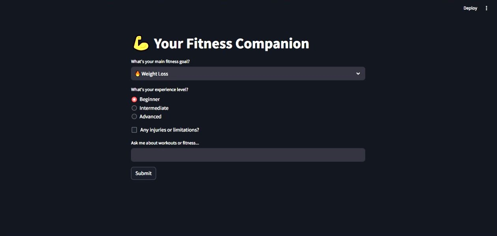

# 💪 Fitness Chatbot

This project is a **web-based AI fitness assistant** designed to provide **personalized workout and fitness guidance** using **Cohere’s language model**. Whether you're a beginner or a seasoned athlete, this chatbot is here to support your fitness journey. 🏃‍♀️💬

---

## 🚀 Features

✨ **Personalized Fitness Advice**  

Get custom-tailored fitness suggestions based on:
- Your **fitness goals** (e.g., weight loss, muscle gain, endurance)
- Your **experience level** (beginner, intermediate, expert)
- Any **physical limitations or restrictions**

🖥️ **Interactive User Interface**  
- Clean and intuitive **Streamlit** interface
- Easily input your preferences and get responses instantly

📚 **Exercise Descriptions**  
- Lookup and learn about a wide range of exercises
- Extracted from a **preloaded dataset** of exercises

🧠 **Natural Language Processing**  
- Powered by **Cohere’s state-of-the-art LLM**
- Understands and answers complex fitness-related queries

---

## 🛠️ Tech Stack

- **Python 3.7+** 🐍
- **Streamlit** 🌐 – Web UI framework
- **Pandas** 📊 – Data handling and manipulation
- **Cohere API** 🤖 – For generating intelligent text responses

---

## 📸 Sample Output



---

## 🔧 Installation & Setup

### 1. Clone the Repository

```bash
git clone https://github.com/yourusername/fitness-chatbot.git
cd fitness-chatbot
```

### 2. Install Dependencies
```
pip install -r requirements.txt
```

### 3. Run the App
```
streamlit run app.py
```

---

## 📬 Connect with Me
If you like this project or want to collaborate, feel free to reach out!

📧 Email: kicha2003e@gmail.com

💼 LinkedIn: [Join my network](www.linkedin.com/in/kishore-thedeveloper)

🐙 GitHub: [Profile Link](https://github.com/Kishore003E)
